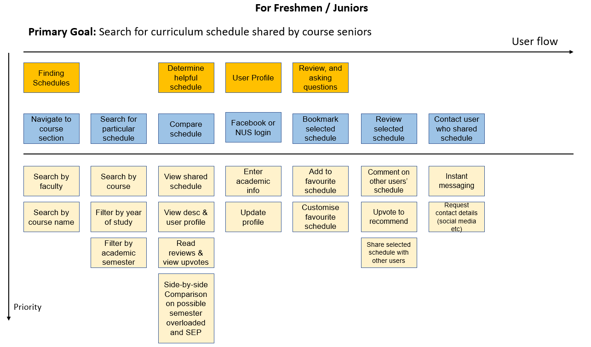
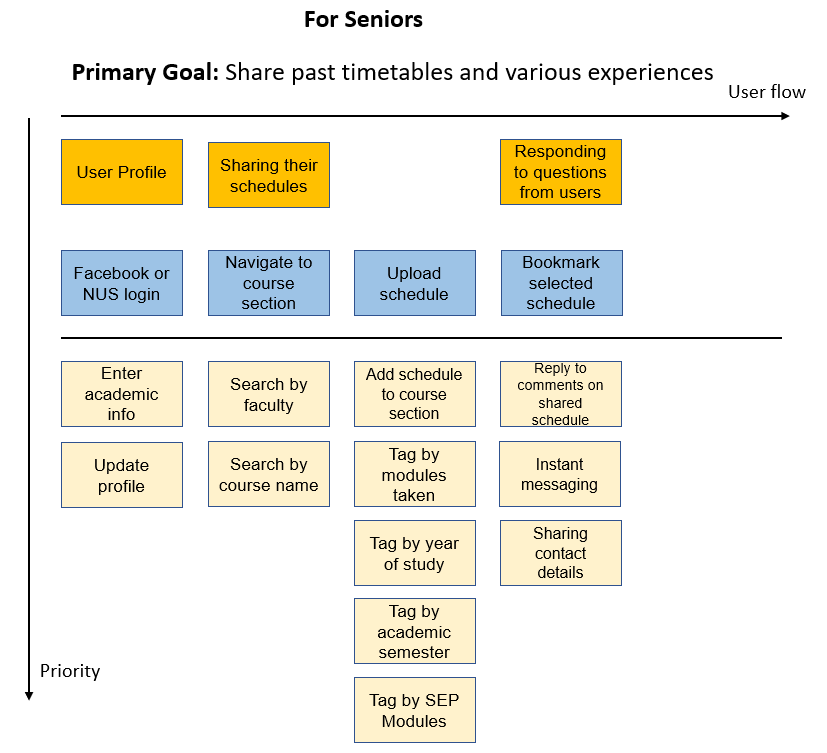

# **NUScheduler**

Group Name: NUScheduler  
Group Members: MINERN CHAN, CHENG XUAN MIN  
Proposed Level of Achievement: Gemini

## Problem description

As a freshmen, they will have issue with schedule planning like facing the dilemma of what modules to choose in their 4 years of studies, not just the the subsequent semesters. Most of the time, the issues tend to be related to fulfilling prerequisites for higher level modules and whether the specific basket of modules taken in one semester will be manageable for a typical student. In the end, students may find that they have not planned their schedules optimally and may even end up taking extra semesters to fulfill certain requirements just to graduate, or end up selecting a basket of modules that is too demanding with heavy workloads. For students interested in SEP, this can be a platform for sharing modules mapping schedule by seniors.  

On the other hand, there are senior students who are enthusiastic about helping others to map out their modules so that others do not face the same problems they did while planning their modules. However, they do not have the channels to share their experiences with others.

## What are we going to do
NUScheduler aims to provide a platform to connect these students with their seniors so that they can find out how their seniors mapped out their modules each semester, to know what problems they faced and they can choose to plan their schedules based on how their seniors have done so. 

On this platform, students can share their past schedules on the website for others to view, as well as add a description for each schedule regarding any problems with the basket of modules in each semester, and also add comments if they had any problems meeting prerequisite requirements. 

Students who are unsure how to map out their modules will be able to see how others before them have planned their study route and avoid any of the problems mentioned above. They can also review and comment on the schedules shared by others to help identify schedules that have helped them better plan their timetables.

## Inspiration and how we are different
NUSMods is our inspiration as we have benefitted a lot from being able to visualize the modules on a timetable. However, only individual modules can be reviewed by students, and not the particular timetable as a whole. Thus, we want to let students share their entire timetable and share their experience with others.

## Features
Some of the features we want to include in our web app include:

1.  CRUD - Users can share their schedules (Create), view schedules shared by others (Read), make changes to their shared schedules (Update), and remove their shared schedules (Delete). 

2.  Integration of Social Media and NUSNET Account - allow users to create an account and log in with their social media or NUSNET IDs so they can be better identified (which will improve the reliability of their shared schedules).

3.  User Interface - to make it easy for users to navigate across different schedules based on different filters.

## System Flow

# Project Timeline

### **Milestone 1**
**Deliverables**
1. README - Documentation of project
2. Project Log - Access it [here]
3. Video - Access it [here]

At the end of Milestone 1, we aim to....

<Who is in responsible for what aspects of the website>

# User Stories
- Essentials  
    1. As a user who is unsure of how to plan my future semesters like modules exemption, can see how seniors have planned their schedules, so can learn from their schedules and plan for oneself. (Priority 1) 
    2. As a user who wants to help others map their modules, I want to be able to share my past schedules on an easily accessible platform, so that I can share my positive or negative experience with others. (Priority 1)
    3. As an admin who can manage schedules from seniors and archive the outdated and irrelevant modules with cross-checking by the department. (Priority 2)
    4. As a user who want to have an idea on  modules that can be mapped for SEP can access seniors mapping template. (Priority 2) 

- Luxury