# **NUScheduler**
  
Group Name: NUScheduler  
Group Members: MINERN CHAN, CHENG XUAN MIN  
Proposed Level of Achievement: Gemini

## Problem description

Students in university at times face the dilemma of planning what modules to choose for not just the next semester, but also the subsequent semesters. This is especially true for freshmen who would be concerned with planning their module routes for 4 years of university education. Most of the time, the issues tend to be related to fulfilling prerequisites for higher level modules and whether the specific basket of modules taken in one semester will be manageable for a typical student. Also, students intending to apply for Student Exchange Programmes(SEP) may also be unsure of how to incorporate the SEP into their module mapping. In the end, students may find that they have not planned their schedules optimally and may even end up taking extra semesters to fulfill certain requirements just to graduate, or end up selecting a basket of modules that is too demanding with heavy workloads.

On the other hand, there are senior students who are enthusiastic about helping others to map out their modules so that others do not face the same problems they did while planning their modules. However, they do not have the channels to share their experiences with others.

## Aim & Project Scope
NUScheduler aims to provide a platform to connect these students with their seniors so that they can find out how their seniors mapped out their modules each semester, to know what problems they faced and they can choose to plan their schedules based on how their seniors have done so. 

On this platform, students can share their past schedules on the website for others to view, as well as add a description for each schedule regarding any problems with the basket of modules in each semester, and also add comments if they had any problems meeting prerequisite requirements. 

Students who are unsure how to map out their modules will be able to see how others before them have planned their study route and avoid any of the problems mentioned above. They can also review and comment on the schedules shared by others to help identify schedules that have helped them better plan their timetables.

## Inspirations and how we are different
1. NUSMods   
We have benefitted a lot from being able to visualize the modules on a timetable. However, only individual modules can be reviewed by students, and not the particular timetable as a whole. Thus, we want to let students share their entire timetable and share their experience with others.

2. NUS CORS & IVLE  
CORS and IVLE are listed as inspirations as we can search for prerequisite modules and view a few timetables. However, they are not very user friendly, and for freshmen, may be difficult to use since they are new to the user interface.

## Features
Some of the features we want to include in our web app include:

1.  CRUD - Users can share their schedules (Create), view schedules shared by others (Read), make changes to their shared schedules (Update), and remove their shared schedules (Delete). 

2. Schedules will be tagged by faculty and course name, as well as module codes among other things. Filters will also be provided so that users can search for relevant schedules more efficiently.

3.  Integration of Social Media and NUSNET Account - allow users to create an account and log in with their social media or NUSNET IDs so they can be better identified (which will improve the reliability of their shared schedules).

4.  User Interaction and Feedback - Users (who are logged in) will be able to comment on schedules shared by others as well as send direct messages to other users. Users will also be able to rate how helpful schedules have been by leaving a "like" on them.

## System Flow

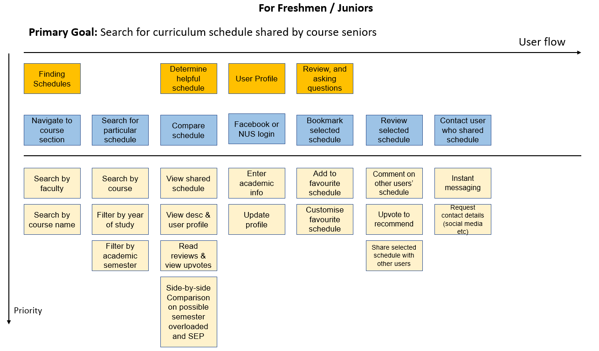

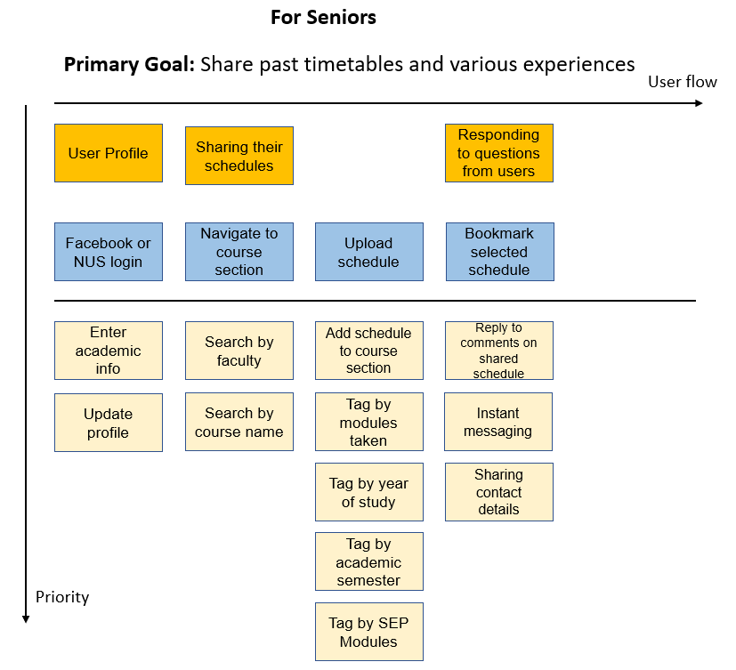

# User Stories
## Essentials
- Freshmen/ Junior Students  
    1. As a user, I want to be able to **quickly find schedules** that are relevant to me, so I won't have to spend too much time searching.

    2. As a user, I want to be able to **know which schedules have been helpful to other students** like myself, so I can look out for them first.

    3. As a user, I want to be able to **provide feedback**, so others can know how helpful a particular schedule has been to me.

    4. As a user, I want to be able to **contact the users who shared their schedules**, so I can ask more in-depth questions and find out more information.

 - Senior Students    
    
    1. As a user, I want to be able to **share my schedules**, so others can learn from my personal experience.

    2. As a user, I want to be able to **respond to any comments or questions on my shared schedules**, so I can provide more useful information to help others.

- Admin    
    
    1. As an administrator, I want to ensure that **only authenticated users on the website can share their schedules**, so that the information shared on the website will be reliable.

    2. As an administrator, I want to ensure that **only authenticated users can message other users or comment on shared schedules**, so that users who share their schedules will not be spammed or harassed.

## Luxury
- Freshmen/ Junior Students  
    (NIL)
- Senior Students  
    (NIL)
- Admin
    1. As an administrator, I want to be able to **manage the shared schedules and archive schedules that contain outdated modules**, so that the information on the web application stays relevant. (Priority 2)

## Tech Stack
- Frontend:
    - HTML, CSS, JS, Bootstrap

- Backend:
    - Django Framework

# Project Timeline

### **Milestone 1**
**Deliverables**
1. README - Documentation of project
2. Project Log - Access it [here](https://docs.google.com/spreadsheets/d/1WXrJ6DX2K2kuVXnYDIx9TSiST4avn1OwMiJcSvajT_U/edit?usp=sharing "Orbital Project Log")
3. Video - Access it [here](https://youtu.be/2QtjWDxdXI0 "Milestone 1 Video")

At the end of Milestone 1, we aim to equipped with the basic skills in using the tools needed to implement the minimum viable product of our web application, along with the overall layout of the web app and essential functionalities it should have to serve its purpose. 

At the start of the project, due to our inexperience with web applications, we experimented with HTML, CSS, JavaScript, Bootstrap, MeteorJS and MongoDB (which we were exposed to during the Liftoff workshops). For our frontend, we have chosen to work with HTML, CSS and JavaScript. For the backend, we were initially quite undecided on what framework to focus on and we went for the PHP and Ruby on Rails Mission Control session to see if we wanted to try using PHP and RoR for our web app. In the end, after much deliberation, we decided to use Django Web Framework and MySQL as we have some prior experience with other programming languages (Python) and MySQL.

We did some initial planning by brainstorming the user stories and constructing the system flow of users on our web application, with the different needs required at each process sorted according to priority levels so that we know what to focus on to produce a minimum viable product. (Refer to System Flow and User Stories section)

For the development of the web application, both of us will work on the design and layout of the application. Xuan Min will be in charge of implementing the frontend while Minern will be in charge of implementing the backend of the web application.

### **Milestone 2**
**Deliverables**
1. README - Documentation of project
2. Project Log - Access it [here](https://docs.google.com/spreadsheets/d/1WXrJ6DX2K2kuVXnYDIx9TSiST4avn1OwMiJcSvajT_U/edit?usp=sharing "Orbital Project Log")
3. Video - Access it [here](https://youtu.be/ObN_UOXi8As "Milestone 2 Video")

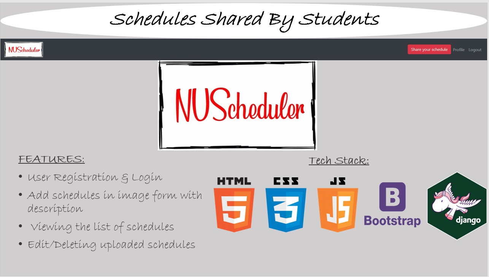

For Milestone 2, we have created a Minimum Viable Product on the web app with basic user sharing functionalities. Overall, it is not what we planned to accomplish by Milestone 2, as many of the functionalities we planned to add (according to the system flow above) are not in place. This is because we encountered some difficulty learning about web development in general, and we faced some problems with the Django framework and had to spend some time learning about how to solve those problems. As such, we decided to keep it simple and work on building it incrementally. 

On the NUScheduler web app, there are User Login and Registration functionalities which uses the inbuilt Django user authentication systems (which hashes passwords and stores them in the database). A Google Captcha is also added to the User Login and Registration form to prevent spam. Basic user profile information is displayed on the users' profile page as well as the schedules they have uploaded. Users can edit their personal information on their profile page and view other users' profile information.

For the sharing of schedules, we have created a basic CRUD for users to upload their schedules (Create), view their own and others' schedules (Read), Edit their uploads (Update), and delete their uploads (Delete). However, due to the difficulties mentioned above, we decided to implement a simple form where users upload an image of their timetable with text inputs of their course and modules taken as well as their schedule description. Logged in and anonymous users will be able to view schedules uploaded by others, however, only logged in users will be able to share their schedules. 

For Milestone 3, we intend to:  
1. Improve on user profile information to include academic information
2. Include tags on schedule uploads as well as group posts by Faculty and course name (so users can filter and search for relevant schedules easily, as it will get messy with the current overall view of uploaded schedules)
3. Improve on the schedule upload form and requirements (e.g. using NUSMods API for module selection etc, possible upgrades instead of uploading image file as the schedule) 
4. Add a "Recommend" button for users to upvote schedules that are helpful
5. Add a "Favourites" section so users can save schedules and refer to them quickly
6. Add a comments section and/or instant messaging
 
## **Web App Preview**
### Homepage (as an anonymous user)
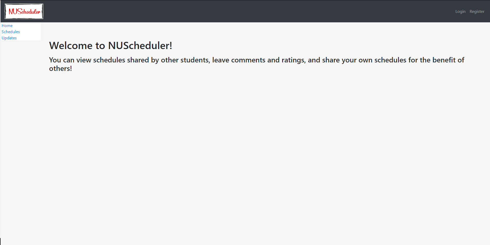
Users will have the option to login or register on the top right, while still being able to access the links in the sidebar

### Homepage (as an authenticated user)
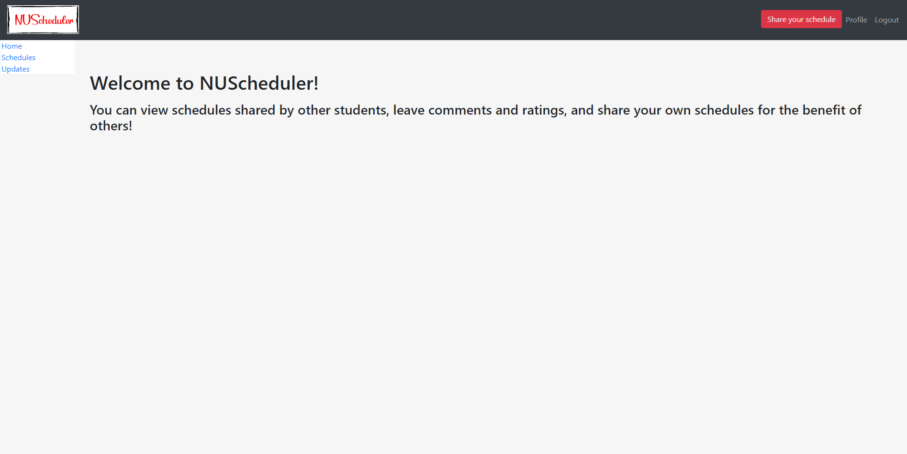
Logged in users have the option to share their schedule on the top right

### Login page
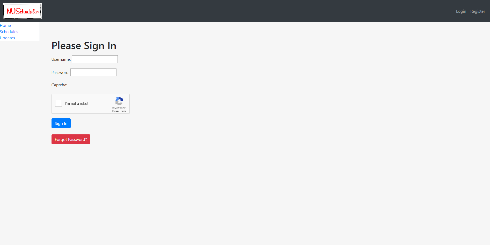

### Registration page
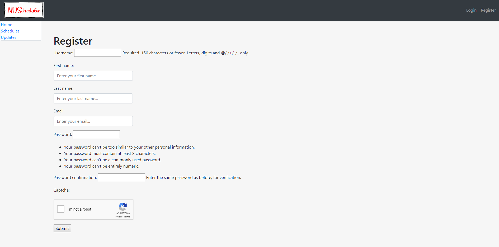

### User Profile page
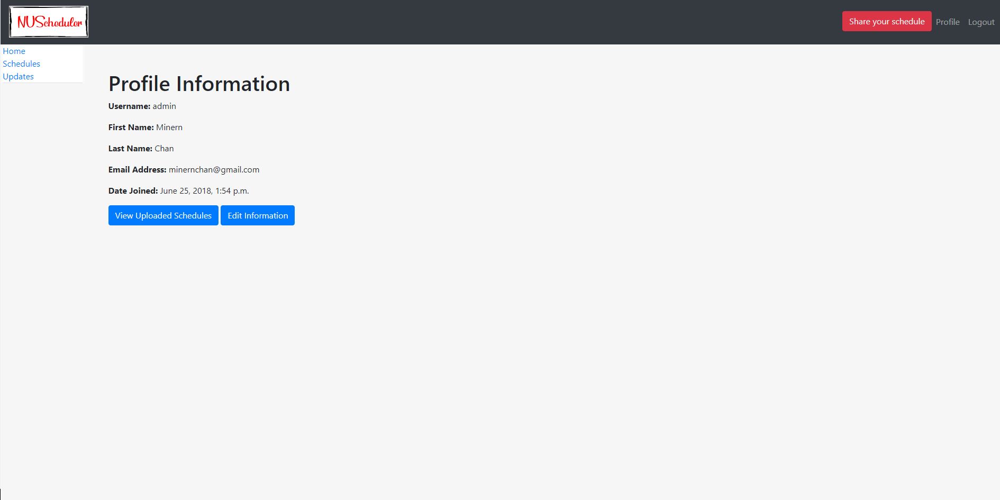

### Upload Schedule page
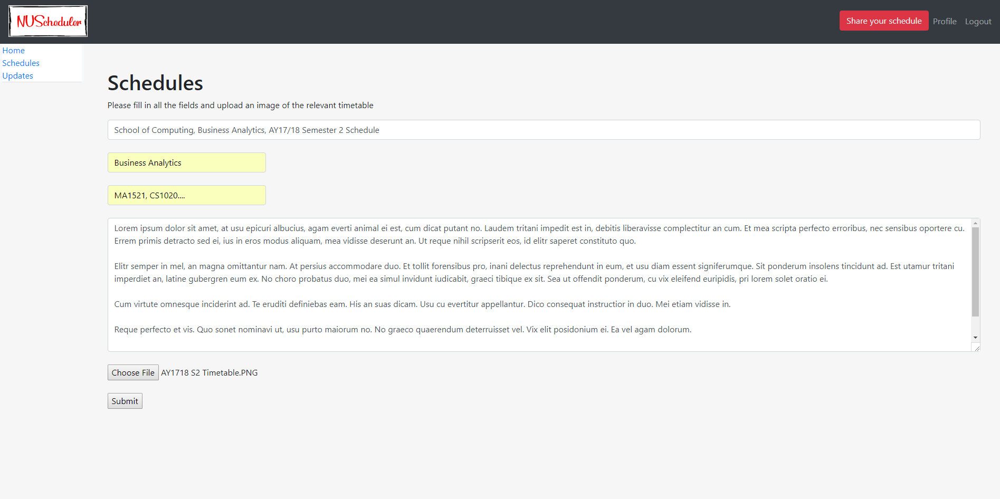

### Overall View Schedule Page
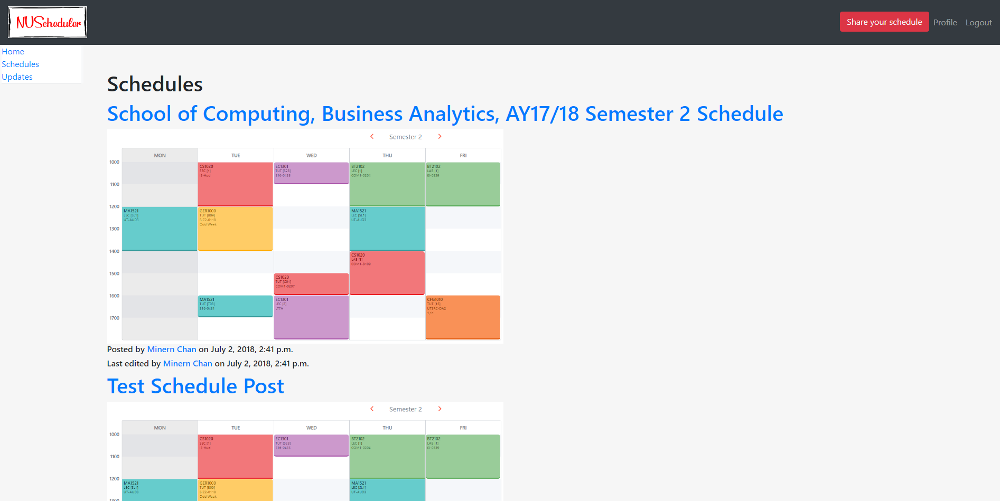

### Detailed View for Schedule 
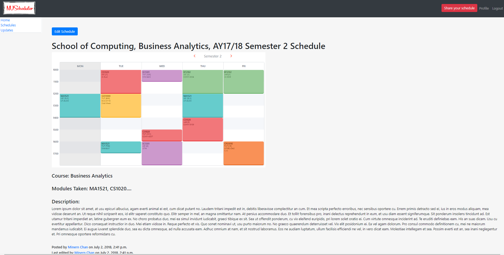

### **Milestone 3**
**Deliverables**
1. README - Documentation of project
2. Project Log - Access it [here](https://docs.google.com/spreadsheets/d/1WXrJ6DX2K2kuVXnYDIx9TSiST4avn1OwMiJcSvajT_U/edit?usp=sharing "Orbital Project Log")
3. Video - Access it [here](https://youtu.be/QVzS0VAtdNY "Milestone 3 Video")

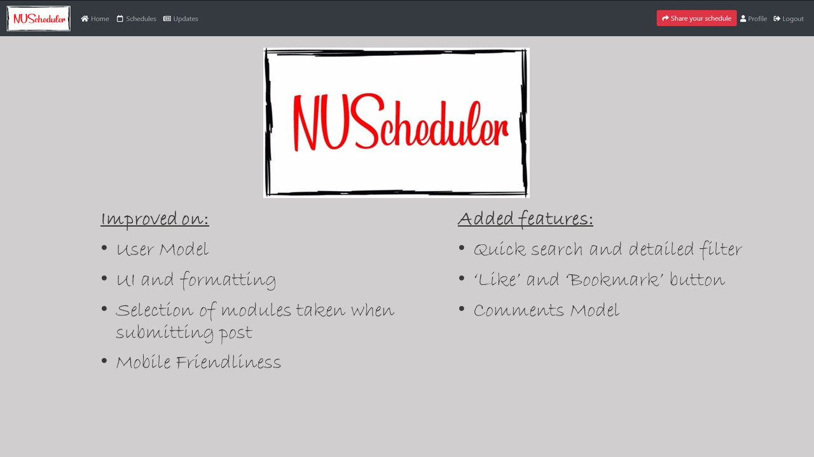

For Milestone 3, we have worked on improving on current features based on feedback from Milestone 2, as well as adding new features to the web application to make it easier to use. 

#### Improvements on current features mentioned in Milestone 2:  
We have made changes to the User Profile model to include more academic information (such as year of study, faculty etc) as well as using email addresses as the users' log in ID instead of unique usernames. After letting some users (other NUS students) test out the web app, we obtained certain feedback regarding the user interface and decided to remove the sidebar and shift its contents into the navbar. The content has also been more centralized and rescaled so that the information is presented in a neater manner which is easier on the users' eyes and icons from FontAwesome were  added to make the UI more pleasant. Also, the code for the html has been edited to be mobile friendly. 

#### New features added for Milestone 3:  
For the schedule post submission, we have added a dropdown text select menu with module codes retrieved from the NUSMods API from semesters 1 and 2 from AY14/15 up to semester 1 AY18/19. We intended to incorporate this feature together with a 'tags' function, however, due to time constraints, we could only implement it as a text field where the selected modules are delimited by commas.

We have also added a quick search which allows users to search for posts containing the specific keywords searched in any field. There is also a more specific filter function which allows users to find posts containing specific information (e.g. specifically containing a particular module and from a particular course). Users can also leave a like on each post to allow others to know how helpful a particular schedule post has been. If a user is really interested in a particular schedule, the user can also bookmark it to refer to it at a later time. The bookmark section can be found on the user's profile page. Lastly, users can also interact with each other and ask questions about the post by leaving or replying to comments on the post page. 

#### Testing:
Initially when we were adding features, we did a lot of self-testing by creating our own accounts, posts, checking to see if every feature was working as intended. We were aware of the automated testing provided through the Django framework, however, we were not sure of how exactly to construct the various test cases for each model, form and view. In the end due to time constraints, we only managed to construct a small number of test cases. We did, however, conduct user testing by letting fellow students try out the web application and obtained their feedback regarding the UI and functionalities and made changes accordingly.

#### Conclusion
All in all, the web application is still not what we imagined from the start. We hoped that we could implement the tagging functionality and improve on the schedule submission format in time for Milestone 3 but unfortunately we did not. However, we are glad with the product we were able to develop for the final milestone and with what we were able to learn throughout Orbital as we started off without a single bit of experience in web development at all.

### New Home Page
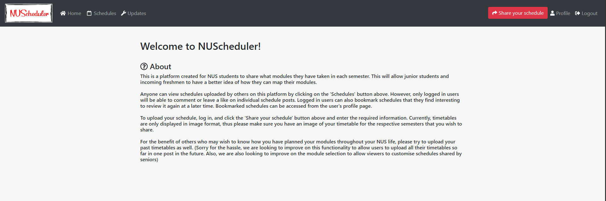

### New Schedules Page
A grid format was implemented after receiving feedback from a user who tested the app.

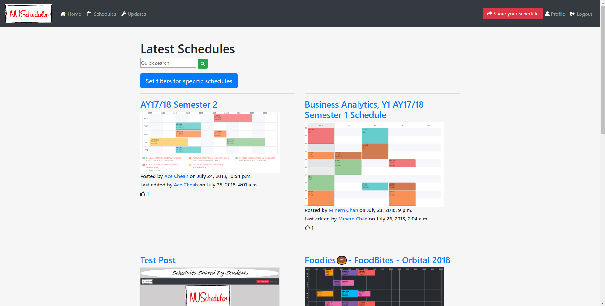

### Filter Page
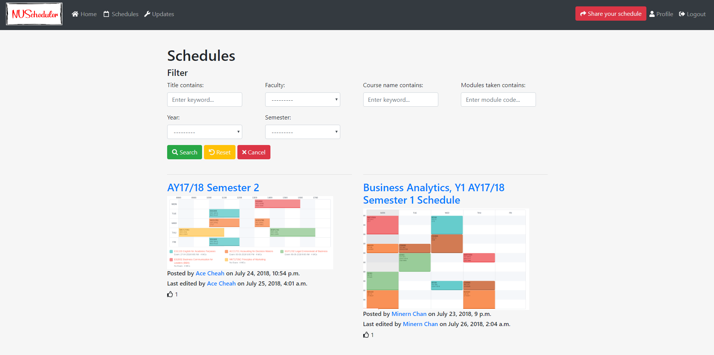

### Likes and Comments
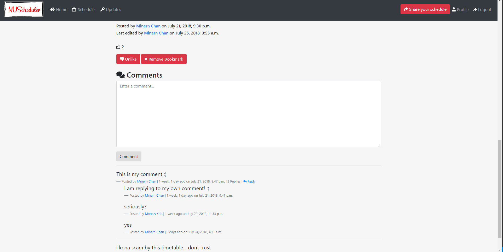

### Bookmark Page
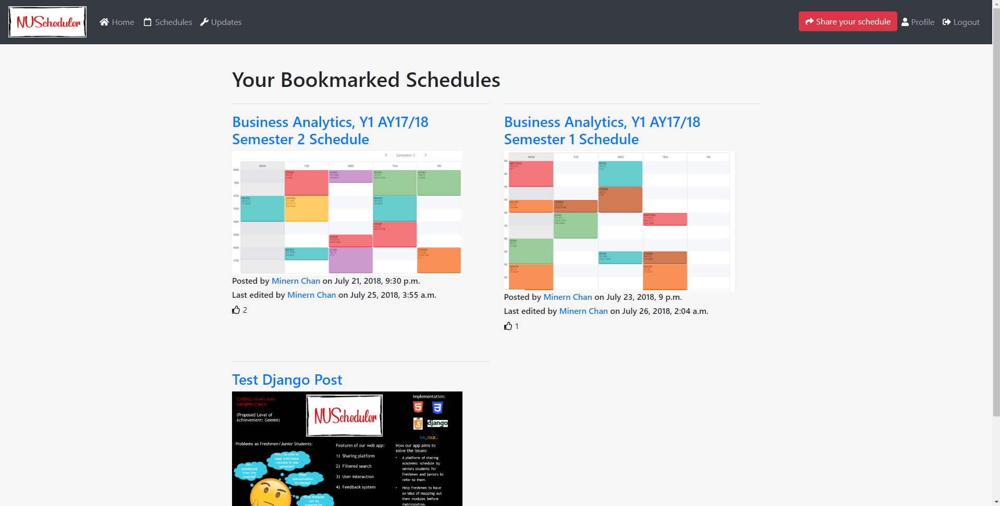